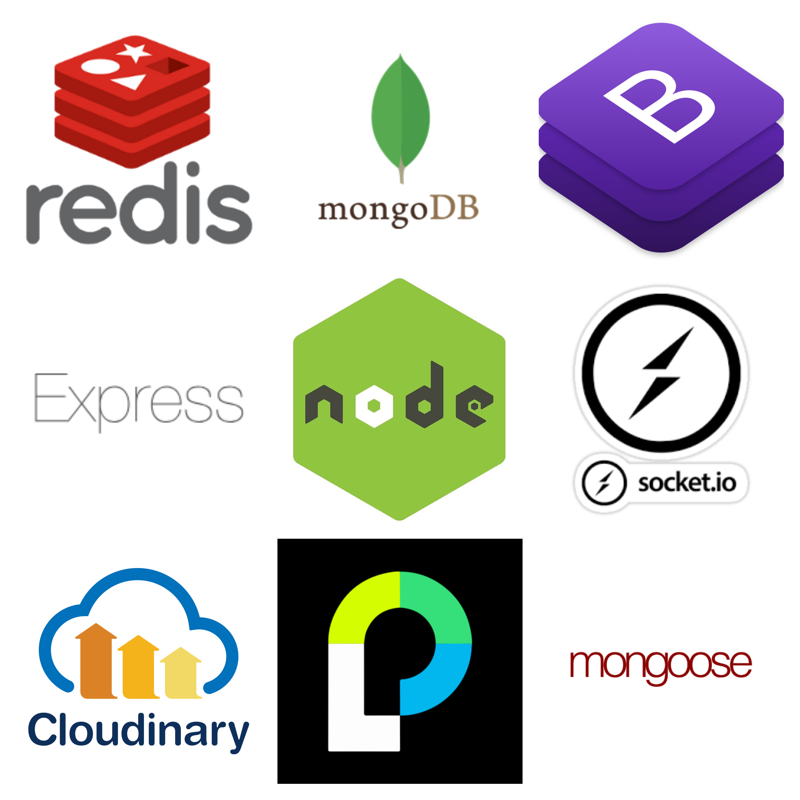

# Random Chat

## Functionality
Simple Chat App that allows users to create and join rooms. 

## Run (For myslef)
 1. Use ngrok to obtain https
 2. Update https address on Facebook Dev
 3. Update Config file (gitignore) 
 2. npm start
 3. ./src/redis-server (from Redis folder)

## Technology Stack

### Framework 
* Express (middleware manager)
	* The other middlewares are plugged into server.js.  

### Front End
* **BootStrap**
	* All in one solution for styling

### Authentification
* **Passport** (Authentificaiton Driver)
	* Passport "driver" to different authentification services
	* Takes in FB App ID and Secret 
	* If Successful Redirects, FB registered callback (Handled in Routes)
	* middle makes users available as req.user
	* logout deletes req.user 
	* Strategy takes in config and process. 
		1.Initilize sessions
		2. Init Passport before passport sessions.
		3. Init Passport Sessions, passport session binds to regular sessions. 

### Users Database 
* **MongoLab** 
	* MongoDb on the cloud.
* **Mongoose** 
	* MongoDb driver
	* Gives mongoDB structure.

### Image Data 
* **Cloudinary** ( Allows Preprocessing)
	* resizes the image for performace. 
	* Once stored in the cloud, we can use the URL to display the image. 

### Comunication 
* **Sock.io** 
	* TCP Listens `.on(x)` for event x, on channel `/of(y)` y, and emits `emit(z)` event z.   
	* `.io(x)` is not a path! It's a channel. 

* **Redis** 
	* Used as message memory buffer.

### Logging
* **Winston** 
	* Can transport log to different channels.
* **Morgan**   
	* Logs HTTP requests.

